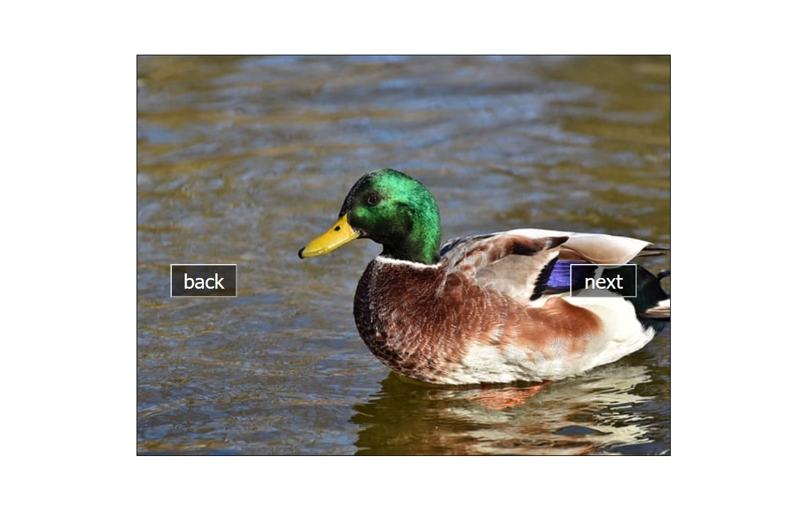

# Slider - JS recruitment task

The task is to create a slider without using libraries, in pure JavaScript. In
the js folder, in addition to the main index.js file, there are .js files (not
connected to index.html), which show alternative solutions to the task.

In addition, which was not the command of the task, I obtained the images from
the public API - here I used the Axios library.

